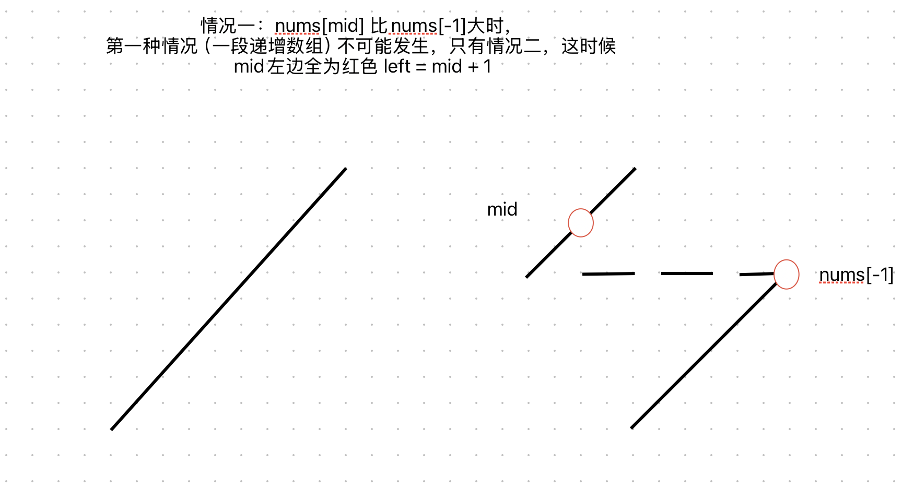

[153. Find Minimum in Rotated Sorted Array](https://leetcode.cn/problems/find-minimum-in-rotated-sorted-array/)


总结：小于最后一个数，就是蓝色，否则是红色




```python
class Solution:
    def findMin(self, nums: List[int]) -> int:
        left = 0
        right = len(nums) - 2
        while left <= right:
            mid = (left + right) // 2
            v = nums[mid]
            # red: 最小值左侧
            # blue: 最小值及右侧
            if v < nums[-1]:
                # 一段递增数组或两段递增数组：右侧为蓝色
                right = mid - 1
            else:
                # v > nums[-1]
                # 两段递增数组：mid左侧染成红色
                left = mid + 1
        return nums[left]
```
