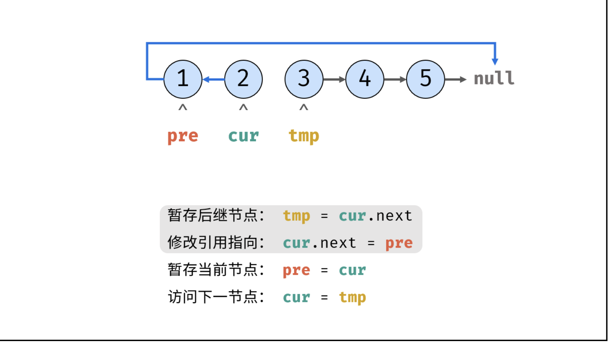

[206. Reverse Linked List](https://leetcode.cn/problems/reverse-linked-list/)


```js
/**
 * Definition for singly-linked list.
 * function ListNode(val, next) {
 *     this.val = (val===undefined ? 0 : val)
 *     this.next = (next===undefined ? null : next)
 * }
 */
/**
 * @param {ListNode} head
 * @return {ListNode}
 */
var reverseList = function (head) {
  if (!head) {
    return null
  }
  let prev = null
  let nxt = head
  while (nxt !== null) {
    const tmp = nxt.next
    nxt.next = prev
    prev = nxt
    nxt = tmp
  }
  return prev
}
```




https://leetcode.cn/problems/reverse-linked-list/solutions/2361282/206-fan-zhuan-lian-biao-shuang-zhi-zhen-r1jel
