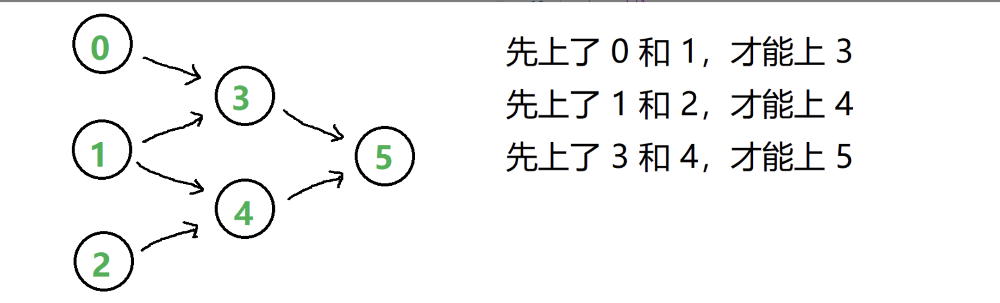

[207. Course Schedule](https://leetcode.cn/problems/course-schedule/)

错误写法：

```python
class Solution:
    def canFinish(self, numCourses: int, prerequisites: List[List[int]]) -> bool:
        alist = defaultdict(list)
        for p in prerequisites:
            alist[p[0]].append(p[1])
        print(alist)
        for k in alist.keys():
            vs = alist[k]
            for v in vs:
                visited = []
                visited.append(k)
                if v in visited: return False
                visited.append(v)
                while v != -1:
                    vs = alist.get(v, -1)
                    if vs == -1: break
                    for v in vs:
                        if v in visited: return False
        return True
```

这个用三色标记法修改就行

```python
class Solution:
    def canFinish(self, numCourses: int, prerequisites: List[List[int]]) -> bool:
        if not prerequisites:
            return True
        alist = defaultdict(list)
        for p in prerequisites:
            alist[p[0]].append(p[1])
        print(alist)
        def dfs(root, visited):
            if not alist[root]:
                return True
            visited.append(root)
            for i in alist[root]:
                if i in visited:
                    return False
                visited.append(i)
                if dfs(i, visited) == False:
                    return False

        return dfs(prerequisites[0][1], [])
```

# Kahn 算法

拓扑排序

https://www.geeksforgeeks.org/dsa/topological-sorting-indegree-based-solution/

### DAG的构建

用有向图描述依赖关系
示例：n = 6，先决条件表：[[3, 0], [3, 1], [4, 1], [4, 2], [5, 3], [5, 4]]
课 0, 1, 2 没有先修课，可以直接选。其余的课，都有两门先修课。
我们用有向图来展现这种依赖关系（做事情的先后关系）：



指向有讲究，从prerequisite 指向需要的课程

作者：笨猪爆破组
链接：https://leetcode.cn/problems/course-schedule/solutions/250377/bao-mu-shi-ti-jie-shou-ba-shou-da-tong-tuo-bu-pai-/
来源：力扣（LeetCode）
著作权归作者所有。商业转载请联系作者获得授权，非商业转载请注明出处。

```python
class Solution:
    def canFinish(self, numCourses: int, prerequisites: List[List[int]]) -> bool:
        # 选课问题其实本质是拓扑排序，每次处理入度为0（当前可选）的节点（队列处理）
        # 修改它修完后的其他课程变化（用邻接表记录）
        indegree = [0] * numCourses
        adj = defaultdict(list) # key为当前课，value为它的后续课程,用列表存

        # 初始化入度和邻接表
        for cur,pre in prerequisites:
            indegree[cur] += 1
            adj[pre].append(cur)
        # 把入度为0的入队列
        q = deque()
        for i in range(numCourses):
            if indegree[i] == 0:
                q.append(i)

        # 开始bfs：
        while q:
            # 当前批次要处理的课程个数
            lenth = len(q)
            for i in range(lenth):
                # 当前处理的课
                pre = q.popleft()
                numCourses -= 1
                # 遍历课程pre的邻接表：它的后续课程
                for cur in adj[pre]:
                    # 课程pre已经完成，入度减一
                    indegree[cur] -= 1
                    # 如果入度减到0，加入队列
                    if indegree[cur] == 0:
                        q.append(cur)
        return numCourses == 0
```

# DFS算法

```python
class Solution:
    def canFinish(self, numCourses: int, prerequisites: List[List[int]]) -> bool:

        adj = defaultdict(list)
        for cur, pre in prerequisites:
            adj[pre].append(cur)

        # dfs if there is cycle return True
        def dfs(node, flags):
            if flags[node] == 1:
                return True
            if flags[node] == -1:
                return False
            flags[node] = 1
            for j in adj[node]:
                if dfs(j, flags): return True
            flags[node] = -1
            return False
        flags = [0] * numCourses
        for i in range(numCourses):
            if dfs(i, flags):
                return False
        return True

```

## 方法二：深度优先遍历

原理是通过 `DFS` 判断图中是否有环。

算法流程：

1. 借助一个标志列表 `flags`，用于判断每个节点 `i`（课程）的状态：  
   a. 未被 DFS 访问： `i == 0`；  
   b. 已被其他节点启动的 DFS 访问： `i == -1`；  
   c. 已被当前节点启动的 DFS 访问： `i == 1`。
2. 对 `numCourses` 个节点依次执行 DFS，判断每个节点起步 DFS 是否存在环，若存在环直接返回 `False`。DFS 流程；  
   a. 终止条件：  
   • 当 `flag[i] == -1`，说明当前访问节点已被其他节点启动的 DFS 访问，无需再重复搜索，直接返回 `True`。  
   • 当 `flag[i] == 1`，说明在本轮 DFS 搜索中节点 `i` 被第 2 次访问，即课程安排图有环，直接返回 `False`。  
   b. 将当前访问节点 `i` 对应 `flag[i]` 置 1，即标记被本轮 DFS 访问过；  
   c. 递归访问当前节点 `i` 的所有邻接节点 `j`，当发现环直接返回 `False`；  
   d. 当前节点所有邻接节点已被遍历，并没有发现环，则将当前节点 `flag` 置为 `-1` 并返回 `True`。
3. 若整个图 DFS 结束并未发现环，返回 `True`。

复杂度分析：

- 时间复杂度 O(N + M)：遍历一个图需要访问所有节点和所有临边，N 和 M 分别为节点数量和临边数量；
- 空间复杂度 O(N + M)：为建立邻接表所需额外空间， `adjacency` 长度为 N，并存储 M 条临边的数据。

作者：Krahets
链接：https://leetcode.cn/problems/course-schedule/solutions/18806/course-schedule-tuo-bu-pai-xu-bfsdfsliang-chong-fa/
来源：力扣（LeetCode）
著作权归作者所有。商业转载请联系作者获得授权，非商业转载请注明出处。
