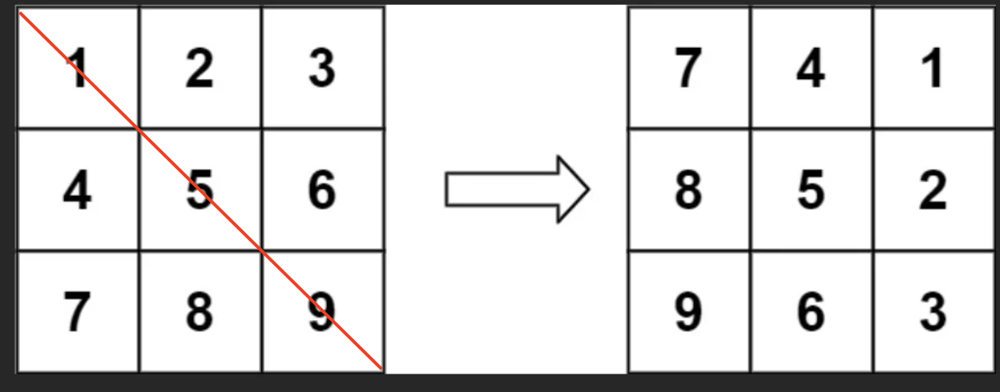

### 方法2:


```js
/**
 * @param {number[][]} matrix
 * @return {void} Do not return anything, modify matrix in-place instead.
 */
var rotate = function (matrix) {
  // 转置
  // 遍历对角线下方元素
  const n = matrix.length
  for (let i = 0; i < n; i++) {
    for (let j = 0; j < i; j++) {
      ;[matrix[i][j], matrix[j][i]] = [matrix[j][i], matrix[i][j]]
    }
  }
  // 行反转
  for (const row of matrix) {
    row.reverse() // reverse 返回反转后的array，并且原数组原地反转
  }
}
```




原先的方法是。先转置对角线下方的元素: 4 -> 7 -> 8 ，这样在未完全转置完成之前，每一行都没有转置完全，所以不能翻转行

现在使用对角线上方的元素转置: 2 -> 3 -> 6，这种情况下 2, 3 转置完成之后就可以翻转行，做到一次遍历

```js
/**
 * @param {number[][]} matrix
 * @return {void} Do not return anything, modify matrix in-place instead.
 */
var rotate = function (matrix) {
  const n = matrix[0].length
  for (let i = 0; i < n; i++) {
    for (let j = i + 1; j < n; j++) {
      ;[matrix[i][j], matrix[j][i]] = [matrix[j][i], matrix[i][j]]
    }
    matrix[i].reverse() // 返回翻转后的数组，并且in-place翻转
  }
}
```

```js
var rotate = function(matrix) {
    const n = matrix.length;
    for (let i = 0; i < n; i++) {
        const row = matrix[i];
        for (let j = i + 1; j < n; j++) { // 遍历对角线上方元素，做转置
            const tmp = row[j];
            row[j] = matrix[j][i];
            matrix[j][i] = tmp;
        }
        row.reverse(); // 行翻转
    }
};

作者：灵茶山艾府
链接：https://leetcode.cn/problems/rotate-image/solutions/3655166/shu-xue-ben-zhi-liang-ci-fan-zhuan-deng-aon4a/
来源：力扣（LeetCode）
著作权归作者所有。商业转载请联系作者获得授权，非商业转载请注明出处。
```

### 方法1：

第col列的元素，变成第col行的元素（不关注元素在行内的顺序，只关注有哪些元素）

第row行的元素，变成第*n*−*row*−1列的元素

有 \(matrix\_{new}[col][n−row−1]=matrix[row][col]\)

用tmp变量暂存 col 和 n - row - 1 的值

则有

tmp = \(matrix\_{new}[col][n−row -1]\)

\( matrix[n-row-1][n-col-1] = matrix[col][n−row−1]\)

直接使用之前的tmp变量储存 \( matrix[n-row-1][n-col-1] \)

同理可得


我们应该枚举哪些位置 (_row_,_col_) 进行上述的原地交换操作呢？


\( (n^2-1)/4 = ((n-1)/2) \times ((n+1)/2) \)

```js
/**
 * @param {number[][]} matrix
 * @return {void} Do not return anything, modify matrix in-place instead.
 */
var rotate = function (matrix) {
  const n = matrix.length
  for (let i = 0; i < Math.floor(n / 2); i++) {
    for (let j = 0; j < Math.floor((n + 1) / 2); j++) {
      const tmp = matrix[i][j]
      matrix[i][j] = matrix[n - j - 1][i]
      matrix[n - j - 1][i] = matrix[n - i - 1][n - j - 1]
      matrix[n - i - 1][n - j - 1] = matrix[j][n - i - 1]
      matrix[j][n - i - 1] = tmp
    }
  }
}
```

###
