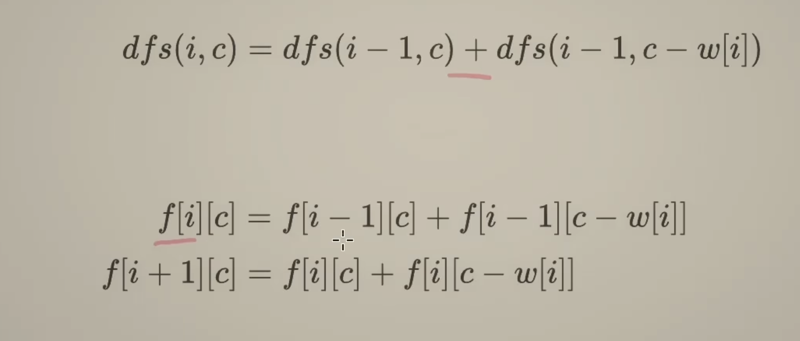

# 0-1 背包问题


### memo dfs

```python
class Solution:
    def findTargetSumWays(self, nums: List[int], target: int) -> int:
        # p: sum of positive
        # n: sum of negative n = s-p
        # s: sum of nums
        # p = s - n
        # p - (s-p) = t
        # 2p - s = t
        # p = (s+t) / 2
        # let x = s+t
        # Then the question is finding a list of positive number which sum is x / 2
        x = target + sum(nums)
        if x < 0 or x % 2:
            return 0
        p = x / 2
        # 0-1 knapsack
        @cache
        def dfs(i, c):
            if i < 0:
                return 1 if c == 0 else 0
            # 只能不选
            if c < nums[i]:
                return dfs(i-1,c)
            return dfs(i-1, c-nums[i]) + dfs(i-1, c)
        return dfs(len(nums) - 1, p)
```

### dp



不应改为w[i+1]：f[i+1]决定的是第i个数字是否被选择，比如f[2][c]考虑的是下标0到1的w数组，如果改为w[i+1]则遍历i从0到n-1的时候数组会越界，w[n]超出输入数组范围了

为什么是target+1: 从 0 到 target 一共 target+1 个数

```python
class Solution:
    def findTargetSumWays(self, nums: List[int], target: int) -> int:
        # p: sum of positive
        # n: sum of negative n = s-p
        # s: sum of nums
        # p = s - n
        # p - (s-p) = t
        # 2p - s = t
        # p = (s+t) / 2
        # let x = s+t
        # Then the question is finding a list of positive number which sum is x / 2


        # x = target + sum(nums)
        # if x < 0 or x % 2:
        #     return 0
        # p = x / 2
        # # 0-1 knapsack
        # @cache
        # def dfs(i, c):
        #     if i < 0:
        #         return 1 if c == 0 else 0
        #     # 只能不选
        #     if c < nums[i]:
        #         return dfs(i-1,c)
        #     return dfs(i-1, c-nums[i]) + dfs(i-1, c)
        # return dfs(len(nums) - 1, p)

        # recurrence
        # (dfs(i) =) dfs(i-1, c-nums[i]) + dfs(i-1, c)
        # f[i] = f[i-1, c-nums[i]] + f[i-1, c]
        # f[i+1] = f[i, c-nums[i]] + f[i, c]

        # i < 0 也进递归了 有 [-1, n-1] (n+1)个递归高度
        # [0, p] 一共 p+1个数
        n = len(nums)
        x = target + sum(nums)
        if x < 0 or x % 2:
            return 0
        p = x // 2
        f = [[0] * (p+1) for _ in range(n+1)]
        f[0][0] = 1 # ( i == 0 and c == 0 时为 1)
        for i, x in enumerate(nums):
            for c in range(p+1): # p 要包括进去
                if c < nums[i]:
                    # if c < nums[i]:
                    #     return dfs(i-1,c)
                    # 这里从 topdown到downtop变为'+'
                    f[i+1][c] = f[i][c]
                else:
                    f[i+1][c] = f[i][c-nums[i]] + f[i][c]
        return f[n][p]

```


