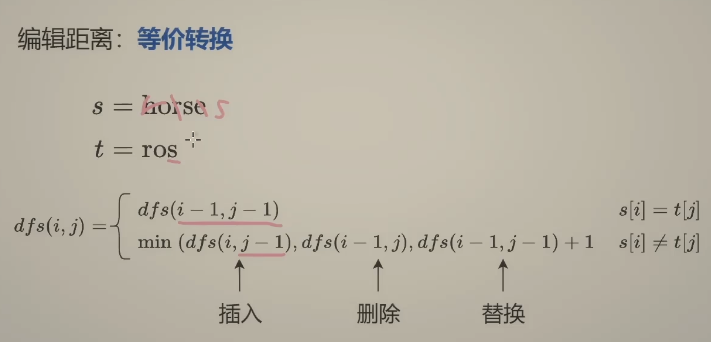

```python
#
# @lc app=leetcode.cn id=72 lang=python3
#
# [72] 编辑距离
#

# @lc code=start
class Solution:
    def minDistance(self, word1: str, word2: str) -> int:
        n = len(word1)
        m = len(word2)
        # @cache
        # def dfs(i, j):
        #     if i < 0:
        #         return j + 1
        #     if j < 0:
        #         return i + 1
        #     if word1[i] == word2[j]:
        #         return dfs(i-1, j-1)
        #     return min(dfs(i-1, j), dfs(i, j-1), dfs(i-1, j-1)) + 1
        # return dfs(n-1, m-1)
        f = [[0] * (m+1) for _ in range(n+1)]
        f[0] = list(range(m+1))
        for i, x in enumerate(word1):
            for j, x in enumerate(word2):

# @lc code=end


```
