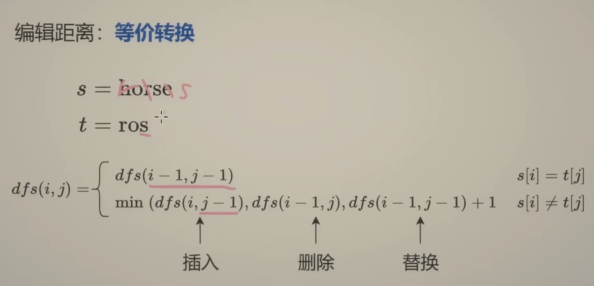

[72. 编辑距离](https://leetcode.cn/problems/edit-distance/)




```js
/**
 * 计算两个字符串之间的最小编辑距离（莱文斯坦距离）
 * 编辑距离定义：将字符串 s 转换成字符串 t 所需的最少操作数
 * 允许的操作：插入一个字符、删除一个字符、替换一个字符
 * @param {string} s - 源字符串
 * @param {string} t - 目标字符串
 * @returns {number} 最小编辑距离
 */
function minDistance(s, t) {
  // 获取两个字符串的长度
  const n = s.length
  const m = t.length

  // 创建记忆化数组 memo，用于存储已经计算过的子问题结果
  // memo[i][j] 表示 s[0...i] 和 t[0...j] 的最小编辑距离
  // 初始值设为 -1，表示该子问题尚未计算
  const memo = new Array(n)
  for (let i = 0; i < n; i++) {
    memo[i] = new Array(m).fill(-1)
  }

  /**
   * 深度优先搜索（DFS）+ 记忆化递归函数
   * @param {number} i - 源字符串 s 的当前索引
   * @param {number} j - 目标字符串 t 的当前索引
   * @returns {number} s[0...i] 和 t[0...j] 的最小编辑距离
   */
  function dfs(i, j) {
    // 情况1：源字符串 s 已经遍历完（i < 0）
    // 此时需要把 t 中剩余的 j+1 个字符全部插入到 s 中，操作数为 j+1
    if (i < 0) {
      return j + 1
    }
    // 情况2：目标字符串 t 已经遍历完（j < 0）
    // 此时需要把 s 中剩余的 i+1 个字符全部删除，操作数为 i+1
    if (j < 0) {
      return i + 1
    }

    // 如果当前子问题已经计算过，直接返回记忆化的结果，避免重复计算
    if (memo[i][j] !== -1) {
      return memo[i][j]
    }

    let res
    // 情况3：当前字符相等，无需任何操作，直接递归处理前一个字符
    if (s[i] === t[j]) {
      res = dfs(i - 1, j - 1)
    } else {
      // 情况4：当前字符不相等，需要选择三种操作中代价最小的一种
      // 1. dfs(i-1, j) + 1：删除 s[i]，操作数+1
      // 2. dfs(i, j-1) + 1：插入 t[j] 到 s[i] 后面，操作数+1
      // 3. dfs(i-1, j-1) + 1：替换 s[i] 为 t[j]，操作数+1
      res = Math.min(dfs(i - 1, j), dfs(i, j - 1), dfs(i - 1, j - 1)) + 1
    }

    // 将当前子问题的结果存入记忆化数组，供后续重复子问题使用
    memo[i][j] = res
    return res
  }

  // 从两个字符串的最后一个字符开始递归计算
  return dfs(n - 1, m - 1)
}
```

在这段代码里，`dfs(i, j)` 是一个**有明确语义的递归函数**，它的定义是：

> 计算「字符串 s 的前 i+1 个字符（s [0]~s [i]）」转换为「字符串 t 的前 j+1 个字符（t [0]~t [j]）」所需的**最小操作数**（也就是这两个子串的最小编辑距离）。
