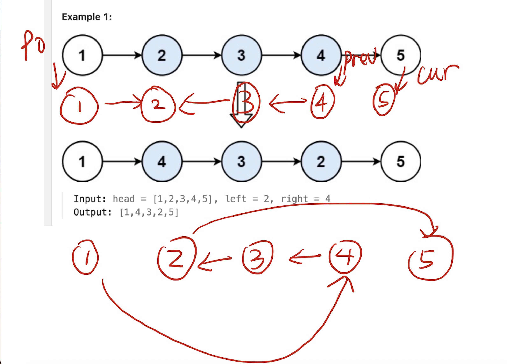

[problem](https://leetcode.cn/problems/reverse-linked-list-ii/description/)





```js
/**
 * Definition for singly-linked list.
 * function ListNode(val, next) {
 *     this.val = (val===undefined ? 0 : val)
 *     this.next = (next===undefined ? null : next)
 * }
 */
/**
 * @param {ListNode} head
 * @param {number} left
 * @param {number} right
 * @return {ListNode}
 */
var reverseBetween = function (head, left, right) {
  const dummy = new ListNode(null, head)
  // dummy为了表示left = 1的情况
  let p0 = dummy
  // p0 表示反转链表之前的那个node
  for (let i = 0; i < left - 1; i++) {
    p0 = p0.next
  }
  let pre = null
  let cur = p0.next
  for (let i = left - 1; i < right; i++) {
    const tmp = cur.next
    cur.next = pre
    pre = cur
    cur = tmp
  }

  p0.next.next = cur
  p0.next = pre
  return dummy.next
}
```
