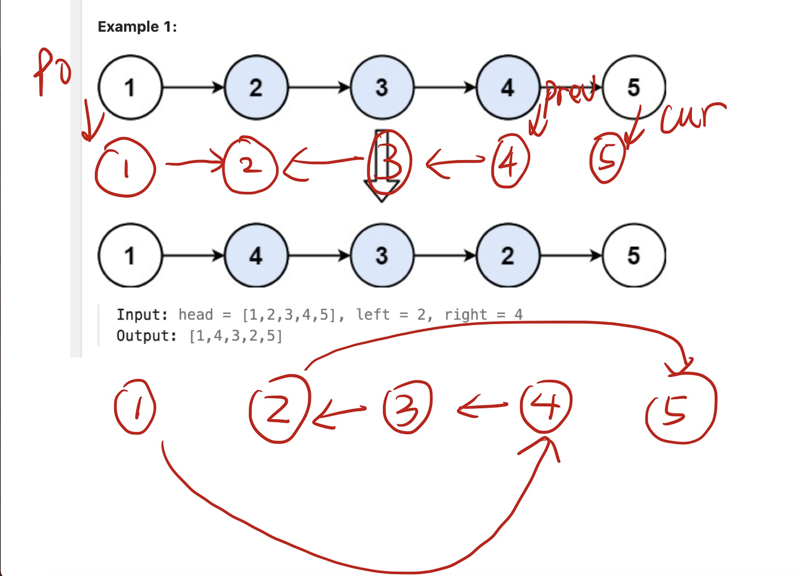

```python
# Definition for singly-linked list.
# class ListNode:
#     def __init__(self, val=0, next=None):
#         self.val = val
#         self.next = next
class Solution:
    def reverseBetween(self, head: Optional[ListNode], left: int, right: int) -> Optional[ListNode]:
        dummy = ListNode(next=head)
        p0 = dummy
        for _ in range(left-1):
            p0 = p0.next
        pre = None
        cur = p0.next
        for _ in range(right-left+1):
            tmp = cur.next
            cur.next = pre
            pre = cur
            cur = tmp
        
        p0.next.next = cur
        p0.next = pre
        return dummy.next


```

https://leetcode.cn/problems/reverse-linked-list-ii/solutions/1992226/you-xie-cuo-liao-yi-ge-shi-pin-jiang-tou-teqq

Keep notice the position of `cur` and `pre` when the ending.


Insert a dummy node before head is because if left == 1, then we need a node before left. To record the address of head. So that is the function of dummy node.