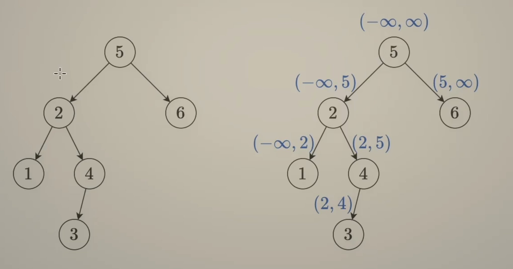

[98. Validate Binary Search Tree](https://leetcode.cn/problems/validate-binary-search-tree/)

# My Solution:

```python
# Definition for a binary tree node.
# class TreeNode:
#     def __init__(self, val=0, left=None, right=None):
#         self.val = val
#         self.left = left
#         self.right = right
class Solution:
    def isValidBST(self, root: Optional[TreeNode]) -> bool:
        if not root:
            return True
        if root.left is None and root.right is None:
            return True
        if root.left is None:
            return root.right.val > root.val and self.isValidBST(root.right)
        if root.right is None:
            return root.left.val < root.val and self.isValidBST(root.left)
        return root.left.val < root.val and root.right.val > root.val and \
        self.isValidBST(root.left) and self.isValidBST(root.right)

```

## 问题

这个写法的**根本问题**在于，它只检查了每个节点的**直接**左右子节点值关系，却没有把“整个左子树的值都要<当前节点”与“整个右子树的值都要>当前节点”这两个**全局约束**纳入考量。

---

## 举个反例

考虑下面这棵树：

```
      10
     /  \
    5    15
        /  \
       6    20
```

- 按你的代码逻辑：
  1. 在根节点 10 处，5<10 且 15>10 ✅，再分别递归检查子树；
  2. 对子树根 15，6<15 且 20>15 ✅，再递归检查它们都是叶子也都返回 True；
  3. 整棵树被判作合法 BST。
- 但实际上，节点 6 在 10 的**右子树**中，却 6<10，**违背**了 BST 要求“右子树所有节点都 > 10”的规则。

---

## 正确思路

要验证一棵树是不是 BST，必须对每个节点维护一个上下界（`lower < node.val < upper`）：

```python
def isValidBST(root):
    def helper(node, lower, upper):
        if not node:
            return True
        val = node.val
        # 如果超出允许区间，立刻 False
        if val <= lower or val >= upper:
            return False
        # 左子树所有节点必须 < val；右子树所有节点必须 > val
        return helper(node.left, lower, val) and \
               helper(node.right, val, upper)

    # 整棵树任意值都要在 (-∞, +∞) 之间
    return helper(root, float('-inf'), float('inf'))
```

这样，访问到节点 6 时，它所在的调用栈里 `lower=10`、`upper=15`，会被马上判为 False。

---

### 另一种简洁做法：中序遍历

因为 BST 的 **中序遍历**结果一定是一个严格递增的序列，我们也可以这样写：

```python
def isValidBST(root):
    prev = float('-inf')

    def inorder(node):
        nonlocal prev
        if not node:
            return True
        if not inorder(node.left):
            return False
        # 这里要严格大于前一个值
        if node.val <= prev:
            return False
        prev = node.val
        return inorder(node.right)

    return inorder(root)
```

这两种方法都能正确处理“深层子孙节点违反祖先约束”的情况，你可以根据习惯任选其一。

# 二叉搜索树



## 前序遍历(preorder traversal)

```python
# Definition for a binary tree node.
# class TreeNode:
#     def __init__(self, val=0, left=None, right=None):
#         self.val = val
#         self.left = left
#         self.right = right
class Solution:
    def isValidBST(self, root: Optional[TreeNode], left=-inf, right=inf) -> bool:
        if not root:
            return True
        x = root.val
        return left < x < right and self.isValidBST(root.left, left, x) and self.isValidBST(root.right, x, right)
```

先访问节点，再遍历左右子树

思路：给`isValidBST` 加上left和right两个参数，二叉搜索树的左子树区间在`(left, x.val)` 之间，右子树同理。

# 中序遍历(inorder)

```python
# Definition for a binary tree node.
# class TreeNode:
#     def __init__(self, val=0, left=None, right=None):
#         self.val = val
#         self.left = left
#         self.right = right
class Solution:
    pre = -inf
    def isValidBST(self, root: Optional[TreeNode]) -> bool:
        if not root:
            return True
        # check left child
        if not self.isValidBST(root.left):
            return False
        # 不能写成 val > self.pre return Ture
        # 不然会直接返回True
        if root.val <= self.pre:
            return False
        self.pre = root.val
        return self.isValidBST(root.right)
```

# 后序遍历(postorder)


