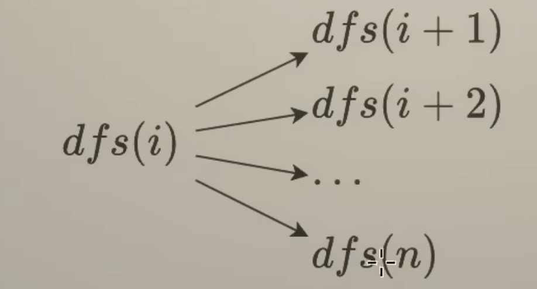

[video](https://www.bilibili.com/video/BV1mG4y1A7Gu/?vd_source=6521ea33363f84e6b8eef296b2e63f0e)

# 嵌套循环到回溯

[17.Letter Combinations of a Phone Number](./17.Letter_Combinations_of_a_Phone_Number.md)


“增量”在这里就是指**增量地构造解**——也就是每次只往当前的“半成品”里**添加一个小片段／一步决策**，而不是一次性把完整答案“全抛”进去。

- 在回溯里，我们通常维护一个“部分解”（比如一个前缀字符串、一个已选的数字集合……）。
- “增量”指的就是每次递归调用时，往这个部分解里**增（add）一小块**：比如第一次从空串 “” 增量地选了 “a”／“b”／“c” 放进去，接着在 “a” 的基础上再增量地选下一个字符，……
- 这样一路“加一块、试一试、回头减掉”就能遍历出所有可能，直到最终积累成一个完整解。

用一句话概括：

> 回溯的“增量构造”就是每层递归都向当前部分解里“增”一个元素（或一步决策），一步步把空解增量地拓展成完整解。

# 回溯 Backtracking


问：为什么视频中在介绍 dfs(i) 的含义时，说我们在枚举下标 ≥i 的剩余部分？dfs(i) 不是在枚举 i 吗？

答：dfs(i) 处理的是从下标 i 到末尾的所有字母组合。dfs(i) 不仅仅在枚举 i，还包含了 dfs(i+1),dfs(i+2),…,dfs(n) 这之后的所有递归调用。单纯说「枚举 i」是不准确的，因为除了枚举 i，还要递归处理剩余部分。正因为如此，我视频中讲的是 ≥i 而不是等于 i。

作者：灵茶山艾府
链接：https://leetcode.cn/problems/letter-combinations-of-a-phone-number/solutions/2059416/hui-su-bu-hui-xie-tao-lu-zai-ci-pythonja-3orv/
来源：力扣（LeetCode）
著作权归作者所有。商业转载请联系作者获得授权，非商业转载请注明出处。

## 子集型回溯

<font color='red'>每种元素都可以选或者不选</font>




```python
class Solution:
    def subsets(self, nums: List[int]) -> List[List[int]]:
        ans = []
        path = []
        n = len(nums)
        def dfs(i):
            ans.append(path.copy())
            # 可以省略，因为有for循环控制
            if i == n:
                return
            for j in range(i,n): # 保证下一个数的下标大于当前数的下标，避免重复
                path.append(nums[j])
                dfs(j + 1) # j + 1是因为当前枚举了j为index，而下一个数字的下标必须大于j
                path.pop()
        dfs(0)
        return ans
```

题目:

[131.Palindrome_Partitioning](./131.Palindrome_Partitioning)

[78.subset](./78.Subsets.md)

# 组合型回溯+剪枝

[77.Combinations.md](./77.Combinations.md)

[216. Combination Sum III](./216.Combination_Sum_III)
