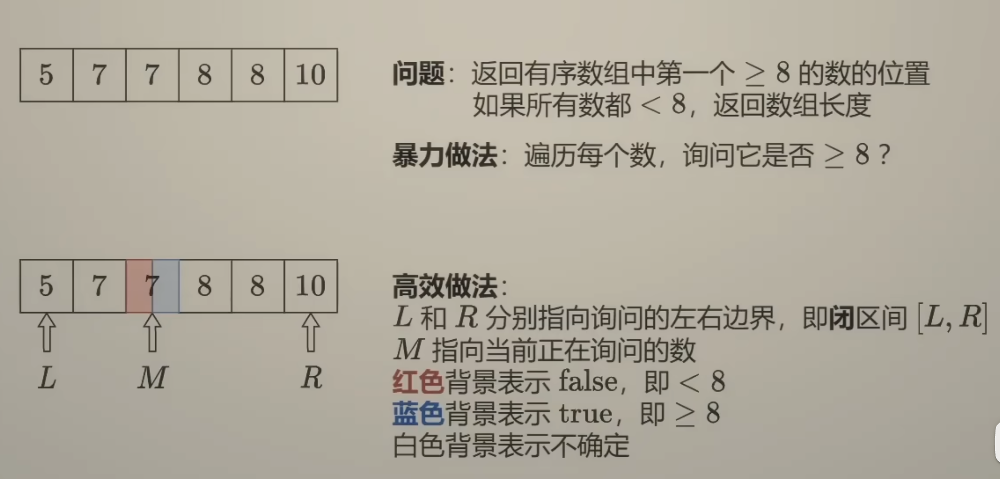
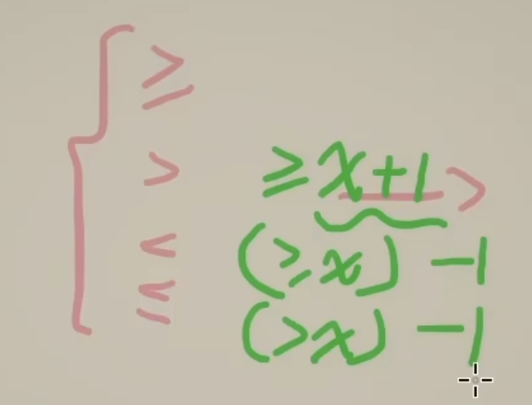

[34. Find First and Last Position of Element in Sorted Array](https://leetcode.cn/problems/find-first-and-last-position-of-element-in-sorted-array/)

注意这里为什么==不是L = M==: 在只有一个元素的情况下，在是L = M 的情况下那么会造成 left == right == mid 的死循环。

e.g.

`[0]`

Left, Right, Mid = 0

==题目中 `>=` 的转换==：

## bisect_left

`bisect_left(a, x, lo=0, hi=len(a))` 返回在区间 `a[lo:hi]` 中**第一个使得 `a[i] >= x` 的索引** `i`。
也就是把 `x` 插到位置 `i`，还能保持有序，且插在所有等于 `x` 的元素**最左边**。
