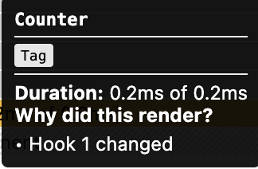

# technique


12 atomic blog

Test.js

```react
import { useState } from "react";

function SlowComponent() {
  // If this is too slow on your maching, reduce the `length`
  const words = Array.from({ length: 100_00 }, () => "WORD");
  return (
    <ul>
      {words.map((word, i) => (
        <li key={i}>
          {i}: {word}
        </li>
      ))}
    </ul>
  );
}

function Counter({ children }) {
  const [count, setCount] = useState(0);
  return (
    <div>
      <h1>Slow counter?!?</h1>
      <button onClick={() => setCount((c) => c + 1)}>Increase: {count}</button>
      {children}
    </div>
  );
}

export default function Test() {
  return (
    <div>
      <h1>Slow counter?!?</h1>
      <button onClick={() => setCount((c) => c + 1)}>Increase: {count}</button>
      <SlowComponent />
    </div>
  );

  // the efficiency for following code would be better

  // return (
  //   <div>
  //     <h1>Slow counter?!?</h1>
  //     <Counter>
  //       <SlowComponent />
  //     </Counter>
  //   </div>
  // );
}

```

# Compare

### Case 1

```react
export default function Test() {
  const [count, setCount] = useState(0);
  return (
    <div>
      <h1>Slow counter?!?</h1>
      <button onClick={() => setCount((c) => c + 1)}>Increase: {count}</button>
      <SlowComponent />
    </div>
  );
```


### Case 2

```react
export default function Test() {
  const [count, setCount] = useState(0);
  return (
    <div>
      <h1>Slow counter?!?</h1>
      <Counter>
        <SlowComponent />
      </Counter>
    </div>
  );
}
```



Slowcomponent not be re-render

**Case 2 would be best**

# Why is this case?

Because in case2 `SlowComponent` pass to `counter` as props. It was created before the `Counter` so `Counter` re-render will not result in `SlowComponent` re-render.

# memo function


[python decorator python 装饰器](https://www.runoob.com/w3cnote/python-func-decorators.html)

# issue with memo


# useCallback

```react
  const handleAddPost = useCallback(function handleAddPost(post) {
    setPosts((posts) => [post, ...posts]);
  }, []);
```

# 为什么context changed


App re-render 触发 PostProvider re-render 而PostProvider 中的value为object，每次re-render的object都不一样。所以context changed

# Improve WorldWise

### Infinite http request

```react
  useEffect(
    function () {
      getCity(id);
    },
    [id, getCity]
  );
```

```react
  async function getCity(id) {
    if (id === currentCity.id) return;
    dispatch({ type: "loading" });
    try {
      const res = await fetch(`${BASE_URL}/cities/${id}`);
      const data = await res.json();
      // setCurrentCity(data);
      dispatch({ type: "city/loaded", payload: data });
    } catch {
      // alert("City not found");
      dispatch({ type: "error", payload: "City not found" });
    }
  }
```

`dispatch` 改变state，触发re-render -> recreate `getCity` function -> 触发 `useEffect` -> 触发 `getCity`

# Bundle size optimization

## Lazy Loading


