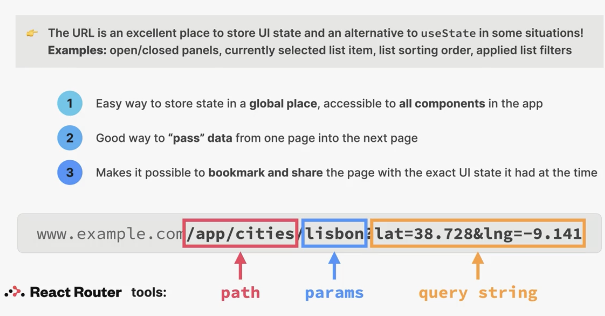

# Storing State in the URL



在 URL 中，**params**（也常叫 “路由参数” 或 “path 参数”）和 **query string**（查询字符串）虽然都能向前端传递数据，但定位方式、语义和使用场景都不一样：

---

## 1. 定义与位置

| 类型             | 位置示例                  | 结构                        |
| ---------------- | ------------------------- | --------------------------- |
| **Path Params**  | `/users/12345`            | 在路径中以 `:` 标记的动态段 |
| **Query String** | `/users?page=2&sort=desc` | `?` 之后的 `key=value` 对   |

- **Path Params**
  - 在 `React Router` 的路由定义里通常写成 `/users/:id`，访问 `/users/12345` 时 `id=12345`。
  - 语义上代表“我要操作的那个具体资源是谁”（resource identifier）。
- **Query String**
  - 在 URL 最后跟一个问号 `?`，后面是一连串 `key=value`，各对之间用 `&` 分隔，比如 `?lat=38.7&lng=-9.1`。
  - 语义上常用于“对资源做一个附加过滤、排序、分页、开关等可选配置”。

---

## 2. 获取方式（以 React Router v6 为例）

- **读取 Path Params**

  ```js
  import { useParams } from 'react-router-dom'
  const { id } = useParams() // 对应路由 /users/:id
  ```

- **读取 Query String**

  ```js
  import { useLocation } from 'react-router-dom'
  const { search } = useLocation() // e.g. "?page=2&sort=desc"
  const params = new URLSearchParams(search)
  const page = params.get('page') // "2"
  const sort = params.get('sort') // "desc"
  ```

---

## 3. 语义和使用场景

| 项目             | Path Params                                          | Query String                               |
| ---------------- | ---------------------------------------------------- | ------------------------------------------ |
| **语义**         | 指定具体的资源或子路径                               | 提供资源的筛选、排序、分页、切换等可选参数 |
| **缓存/SEO**     | 通常更具语义化，路径变化会被搜索引擎当作不同页面索引 | 经常用于纯前端状态切换，不一定影响 SEO     |
| **必需 vs 可选** | 标识“必需”资源（一般不能省略）                       | 一般是“可选”功能（省略则用默认值）         |

---

### 举例

```
// 路由定义
<Route path="/cities/:cityName" element={<CityPage />} />

// 1) path param
// 访问 /cities/lisbon 时
const { cityName } = useParams();  // cityName === "lisbon"

// 2) query string
// 访问 /cities/lisbon?lat=38.728&lng=-9.141 时
const { search } = useLocation();
const qs = new URLSearchParams(search);
const lat = qs.get('lat');         // "38.728"
const lng = qs.get('lng');         // "-9.141"
```

- **当你要“定位”或“切换”到某个资源**（比如某个用户、某个城市、某个文章）时，用 **Path Params**。
- **当你要在同一个页面上做筛选、排序、分页或保存一些 UI 状态**时，用 **Query String**。

---

这样划分，URL 可读性更强、路由设计更清晰，前后端也能更好地协同约定。

App.jsx

```react
<Route path="cities/:id" element={<City />} />
```

CityItem.jsx

```react
      <Link
        className={styles.cityItem}
        to={`${id}?lat=${position.lat}&lng=${position.lng}`}
      >
```

City.jsx

```react
  const [searchParms, setSearchParams] = useSearchParams();
  const lat = searchParms.get("lat");
  const lng = searchParms.get("lng");
  const { id } = useParams();
```

`const { id } = useParams();`

useParams这里返回一个object {id: '123456'}

这里是id的原因是`<Route path="cities/:id" element={<City />} />`这里设置成了id

## Search Parameters

添加:

```react
      <Link
        className={styles.cityItem}
        to={`${id}?lat=${position.lat}&lng=${position.lng}`}
      >
```

在parms之后加`?`, search params 之间用`&`隔开

使用:

```react
  const [searchParms, setSearchParams] = useSearchParams();
  const lat = searchParms.get("lat");
  const lng = searchParms.get("lng");
```

### Set search params through setSearchParams

```jsx
<button
  onClick={() => {
    setSearchParams({ lat: '23', lng: '50' })
  }}
>
  Change pos
</button>
```
