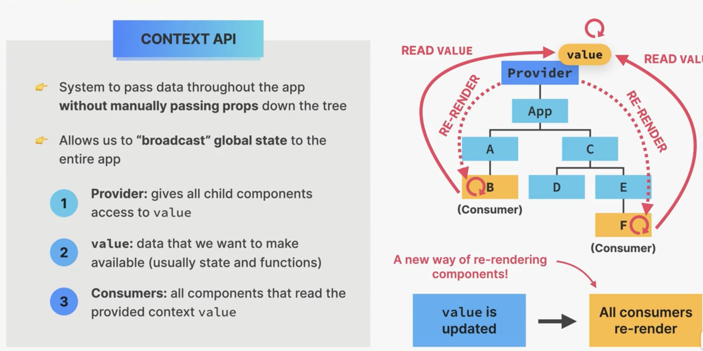
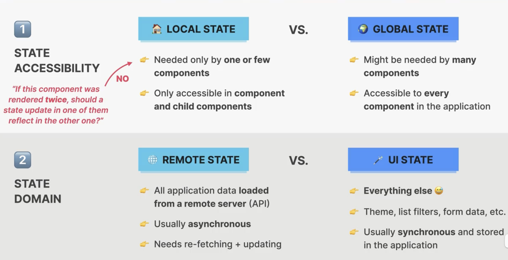

# context API



1. cereate a context: `const PostContext = createContext()` Post is capital because we use it like a component. Can be seen as create a new data type.
2. provide value to child components: wrap all needed components by `<PostContext.Provider value={{posts: searchPosts}}>... </PostContext.Provider>` value 一般是object
3. consume context value: useContext: `const {onClearPost} = useContext(PostContext)` useContext return whole object.

# useState中的lazy initialization

**惰性初始化（lazy initialization）**

```
js


CopyEdit
useState(() => Array.from(…))
```

如果你传给 `useState` 的是一个函数，React 会在**初次渲染**时调用它，并把返回值当做初始状态；后续重新渲染**不会**再执行这个函数，能避免一次性开销较大或需要随机数、网络请求等的操作反复运行。

当你这样写：

```js
// ❶ 直接把表达式放在 useState 里
const [data1, setData1] = useState(expensiveComputation())
```

JavaScript 会在执行到这行代码时**立即**调用 `expensiveComputation()`，无论是“首次渲染”还是“后续更新渲染”都会执行一次，开销无法控制。

而这样写：

```js
// ❷ 把初始化逻辑”包装“成函数
const [data2, setData2] = useState(() => expensiveComputation())
```

- 传给 `useState` 的**不是** `expensiveComputation()` 的结果，而是一个箭头函数 `() => expensiveComputation()`。

- 这个箭头函数会在 JavaScript 执行到这一行时被“创建”一次（但**不**运行函数体），作为一个普通值传给 React。

- React 内部的 hooks 实现大致是这样（伪代码）：

  ```js
  function useState(initial) {
    const hook = getCurrentHookSlot()
    if (isFirstRender) {
      // 只有“首次挂载”时，React 才会检查 initial：
      // 如果 initial 是函数，就执行它；否则直接用它当值
      hook.state =
        typeof initial === 'function'
          ? initial() // ← 真正调用 expensiveComputation()
          : initial // ← 直接就是值
    }
    return [hook.state, setState]
  }
  ```

- **关键**：

  1. JavaScript 在遇到 `useState(() => …)` 时 **不会**执行箭头函数，只是把它当作“初始值提供者”塞给 React。
  2. React 又只在**第一次挂载**阶段，才会“剥开”这个函数、调用一次，取得真正的初始状态；后续渲染再也不会进到这段分支，自然也不会重复执行。

---

### 总结

- **不包裹成函数**：初始化逻辑在**每次渲染**前就会跑，可能造成多次不必要的计算。
- **包裹成函数**：JavaScript 只创建函数对象，不执行；React 只在**首次挂载**时调用一次，从而实现“惰性初始化”。

当你这样写：

```js
function App() {
  // ❌ 这里的 expensiveComputation() 会在每次渲染时都被执行
  const [data, setData] = useState(expensiveComputation());
  …
}
```

### 1. React 渲染流程里，组件函数本身会“重新跑”

React 在每次状态更新后，都会**重新调用**你的函数组件 `App()`，完成一次新的 render。JavaScript 会从上到下依次执行函数体里的每一行——包括调用 `expensiveComputation()` 去“算”传给 `useState` 的那个参数。

> 换句话说：**“参数的求值”**（`expensiveComputation()`）发生在 React 判断“要不要用它来初始化 state”之前，且是纯 JS 的行为，React 并不会拦截或缓存这个求值过程。

### 2. useState 里的“初始值”只在第一次挂载时生效

React 内部大致做的是：

```js
function useState(initial) {
  const hook = getCurrentHook()
  if (isFirstRender) {
    // 如果 initial 是函数，就调用 initial()
    // 否则就直接用 initial 这个值
    hook.state = typeof initial === 'function' ? initial() : initial
  }
  return [hook.state, setState]
}
```

- **参数 initial** —— 已经是“外面算好”的东西了。
- React 只在首次挂载时去解包（如果它是函数就再调用一次），后续都跳过这段逻辑，直接返回 `hook.state`。

但注意：**JS 会在每次执行组件函数体时，先把 `expensiveComputation()` 或者箭头函数 `() => expensiveComputation()` “算”出来，才交给 React。**

---

## 为什么要包成函数才能真正“惰性”？

```js
// ——写法 A：每次渲染都算一次——开销大
useState(expensiveComputation())

// ——写法 B：创建一个“惰性求值器”函数，但不执行它
useState(() => expensiveComputation())
```

1. **写法 A**
   - JavaScript 执行到这里，立刻跑 `expensiveComputation()`，把结果传给 React。
   - **无论**是第一次渲染还是后续更新，函数组件体都会跑到这一行，就会反复调用。
2. **写法 B**
   - JavaScript 执行到这里，只“创建”了一个箭头函数 `() => expensiveComputation()`，**不**执行它。
   - React 拿到这个函数作为 `initial` 参数：
     - **第一次**掛载时，React 会检测到参数是函数，就执行一次它，拿回真正的初始值；
     - **后续**渲染时，React 根本不会去执行参数函数，直接返回存着的 state。

---

### 小结

- **JS 在函数组件里执行代码** 的时机：**每次** render 都会跑组件函数体。
- **useState(initialValue)**：React **只用** `initialValue` 在 mount 时初始化一次 state，不管后面传的 initialValue 怎么变化，都不会重新初始化。
- **但**如果你把开销逻辑写成直接调用的表达式，JS 还是会每次都算一遍。
- **解决办法**：把开销逻辑“包一层”成函数，借助 React 对“函数型初始值”只在挂载时调用一次的特性，从而避开后续渲染的重复计算。

# State Management



## Context 本身不代表State

在 React 中，`useState` 和 `useContext` 都是用来在函数组件中管理和读取“状态”（state）或共享数据的 Hook，但它们关注的粒度和使用场景不同：

#### 1. 核心功能对比

| 特性     | useState                              | useContext                                        |
| -------- | ------------------------------------- | ------------------------------------------------- |
| 来源     | React 内置 Hook                       | React 内置 Hook                                   |
| 功能     | 在同一个组件内部声明并管理局部状态    | 从上下文（Context）中读取共享状态或数据           |
| 返回值   | `[state, setState]`                   | `contextValue`                                    |
| 更新触发 | 调用 `setState` 时导致组件重新渲染    | 当**提供者**(`Provider`)的 `value` 变化时         |
| 适用范围 | 单一组件或通过 props 向下传递给子组件 | 跨越组件树，避免“逐层传递 props”（prop drilling） |

#### 2. 使用场景

- **useState**
  - 组件内部自己管理的状态，如表单输入值、折叠面板的展开/收起、计数器的当前值等。
  - 状态只在该组件或通过 props 显式传递给子组件时使用，不涉及全局或跨多层组件共享。
- **useContext**
  - 需要在组件树中多处读取同一份数据时（如当前用户信息、主题色、国际化文案、全局配置等）。
  - 用来“消费”通过 `<MyContext.Provider>` 提供的值，不负责创建或更新上下文本身（Context 对象通常与 `useState`、`useReducer` 等结合，在 Provider 里管理状态）。

#### 3. 简单示例

##### 3.1 用 `useState` 管理局部状态

```jsx
import React, { useState } from 'react'

function Counter() {
  // 在当前组件内部声明一个 count 状态，以及更新它的 setCount
  const [count, setCount] = useState(0)

  return (
    <div>
      <p>当前计数：{count}</p>
      <button onClick={() => setCount(count + 1)}>加 1</button>
    </div>
  )
}
```

##### 3.2 用 `useContext` 读取跨组件共享的状态

```jsx
import React, { useState, createContext, useContext } from 'react'

// 1. 创建 Context 对象
const ThemeContext = createContext()

// 2. 在顶层组件或某个父组件中，用 Provider 提供 value
function App() {
  const [theme, setTheme] = useState('light')

  return (
    <ThemeContext.Provider value={{ theme, setTheme }}>
      <Toolbar />
    </ThemeContext.Provider>
  )
}

// 3. 在任意深度的子组件中，用 useContext 读取
function Toolbar() {
  return (
    <div>
      <ThemeSwitcher />
    </div>
  )
}

function ThemeSwitcher() {
  // 从 ThemeContext 中拿到当前主题及切换方法
  const { theme, setTheme } = useContext(ThemeContext)

  return (
    <div>
      <p>当前主题：{theme}</p>
      <button onClick={() => setTheme(theme === 'light' ? 'dark' : 'light')}>切换主题</button>
    </div>
  )
}
```

- `useContext` 只能读取 Context 的值，真正的“更新”通常在 Provider 所在组件里，用 `useState`、`useReducer` 等管理，然后把 state/setter 作为 Context 的 `value`。

- 用 `useState` 聚焦于“本组件”状态管理；用 `useContext` 聚焦于“组件树”层面的跨层级数据共享。
