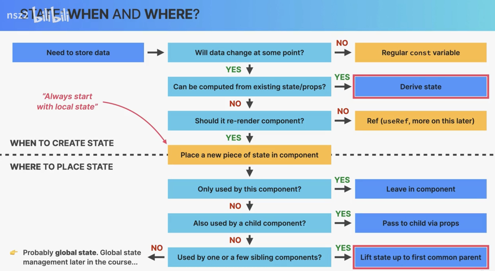

[state management](https://www.bilibili.com/video/BV11M4m1z72h?spm_id_from=333.788.videopod.episodes&vd_source=6521ea33363f84e6b8eef296b2e63f0e&p=77)

# global state and local state



在 React 应用中，**local state**（局部状态）和 **global state**（全局状态）主要区别在于它们的作用域、管理方式和使用场景：

---

## 1. 作用域（Scope）

- **Local State（局部状态）**

  - 定义在单个组件内部，只对该组件（及其子组件通过 props 传递）可见和可用。
  - 通常通过 `useState`、`useReducer` 或 `this.setState`（类组件）来管理。
  - 用于存储和管理仅与该组件渲染或行为直接相关的数据，比如表单输入值、开关开关状态、局部 UI 折叠、计时器状态等。

  ```jsx
  function Counter() {
    const [count, setCount] = useState(0) // 这是 local state
    return <button onClick={() => setCount((c) => c + 1)}>{count}</button>
  }
  ```

- **Global State（全局状态）**

  - 超越单个组件边界，可被应用中多个不相关的组件共享和访问。
  - 可用于存储用户鉴权信息、主题（light/dark）、多页面/多组件间的购物车数据、表单跨页面的中间结果、客户端本地缓存等。
  - 通常通过 Context API、Redux、MobX、Zustand、Recoil 等全局状态管理库来实现。

  ```jsx
  // ThemeContext.js
  const ThemeContext = createContext('light')

  // App.js
  ;<ThemeContext.Provider value={theme}>
    <NavBar />
    <Content />
  </ThemeContext.Provider>

  // NavBar.js
  const theme = useContext(ThemeContext) // 访问全局的 theme
  ```
