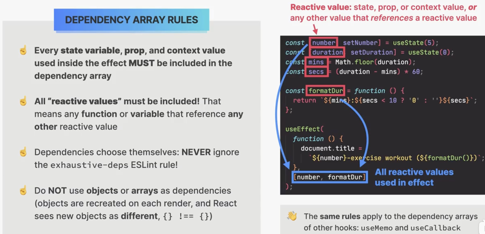
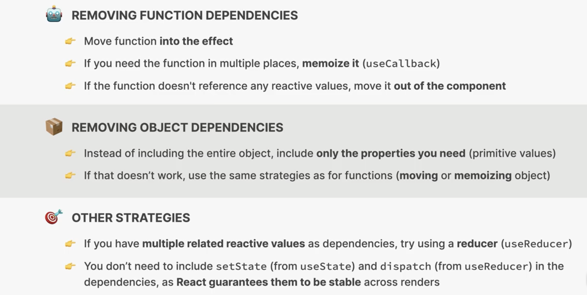

这句 “Hooks must be called in the same order”（钩子必须以相同的顺序调用）出现在你违反了 React 的「Hooks 规则」（Rules of Hooks）时。它的含义是：

1. **React 通过调用顺序来匹配每一个 useState/useEffect……背后的状态槽位**

   - 第一次渲染时，React 会依次给第 1 个 hook 插槽、第 2 个 hook 插槽……分配 state 或 effect。
   - 下一次渲染时，React 就是按同样的顺序去拿这些插槽里的数据。

2. **如果顺序不一致，就会拿错插槽，从而出错**

   - 例如，你在一个分支里才调用 `useState`：

     ```jsx
     function MyComp({ flag }) {
       if (flag) {
         // 第一次渲染 flag=true，会调用这个 useState，去第 1 个槽
         const [x, setX] = useState(0)
       }
       // flag=false 时，上次已经在第 1 个槽放了 state，
       // 这次没调用，就会导致后续所有槽都往前挪一个，拿不到正确的 state
       const [y, setY] = useState(0)
       // …
     }
     ```

   - 这时 React 会报 “Rendered more hooks than during the previous render” 或 “Rendered fewer hooks…”。

3. **正确做法：**

   - **所有的 hook 都要写在组件最顶层**，不要放在 `if`、`for`、`switch`、早期 `return` 之后或任何循环/条件里。
   - 确保每次渲染，hook 的调用次数和相对顺序都**完全一致**。

---

### 例子

❌ 错误写法（条件调用）：

```jsx
function Comp({ show }) {
  if (show) {
    useEffect(() => { … }, []);
  }
  useState(0);
  // ↓ 这里 React 可能会拿错 useState 对应的插槽
}
```

✔️ 正确写法（无条件调用）：

```jsx
function Comp({ show }) {
  useEffect(() => {
    if (show) {
      // 在 effect 里再判断
    }
  }, [show])

  const [count, setCount] = useState(0)
  // 每次渲染都按同样的顺序执行 useEffect → useState
}
```

总结：**“hook must be at same order”** 就是提醒你，所有的 React Hooks（`useState`/`useEffect`/`useContext`……）必须在组件体内顶层、每次渲染都以完全相同的顺序出现，才能保证状态正确匹配。

# deps array





这张图是在讲如何解决 React Hooks（特别是 `useEffect`、`useCallback` 等）依赖数组里「函数」和「对象」不断变化导致的重复执行问题。我们分三部分来解释：

---

## 1. 移除函数依赖（Removing Function Dependencies）

当你把一个函数写在组件体里，并且在 `useEffect`、`useCallback`、`useMemo` 等里引用它，就必须把它加到依赖数组中。若函数每次渲染都新建，就会导致副作用不断重跑，或者缓存失效。常见的解决办法有：

1. **把函数挪到 `useEffect` 里**

   ```jsx
   // ❌ 每次 render 都重建 fetchData，导致 effect 一直重新执行
   function MyComponent({ userId }) {
     const fetchData = () => {
       /* ... */
     }
     useEffect(() => {
       fetchData()
     }, [fetchData])
     // …
   }

   // ✔️ 直接把逻辑写在 effect 里，去掉函数依赖
   function MyComponent({ userId }) {
     useEffect(() => {
       // fetchData 逻辑写这里
     }, [userId])
     // …
   }
   ```

2. **用 `useCallback` 把函数 memoize**

   ```jsx
   const fetchData = useCallback(() => {
     /* … */
   }, [userId])
   useEffect(() => {
     fetchData()
   }, [fetchData])
   ```

   这样只有当 `userId` 变时才重建 `fetchData`，`useEffect` 也只会跑一次。

3. **若函数内部不依赖任何 props/state，就干脆移到组件外部**

   ```jsx
   // module-scope.js
   export function doSomething() {
     /* … */
   }

   // Component.jsx
   import { doSomething } from './module-scope'
   useEffect(() => {
     doSomething()
   }, []) // 永远不会变
   ```

---

## 2. 移除对象依赖（Removing Object Dependencies）

对象或数组在 JS 里每次新建都是不同引用，即使属性值相同，也会让依赖失效。做法类似：

1. **只依赖需要的原始值（primitive）**

   ```jsx
   // ❌ 依赖整个 config 对象，每次 render 都是不同行引用
   useEffect(() => {
     /* … */
   }, [config])

   // ✔️ 只依赖 config.someFlag、config.url 等具体字段
   useEffect(() => {
     /* … */
   }, [config.url, config.someFlag])
   ```

2. **若确实需要整块对象，按函数那套走**：

   - 在 effect 里直接用或拆字段
   - 用 `useMemo` 缓存对象
   - 或者把对象移到组件外／父组件里管理

---

## 3. 其他策略（Other Strategies）

- **用 `useReducer` 组合相关 state**
  当有好几个互相关联的 state（比如表单字段、筛选条件）都要一起作为依赖时，可以考虑把它们放到一个 reducer 里，只依赖 dispatch 或一个总的状态对象，减少依赖项数目。
- **不用把 `setState` 或 `dispatch` 放进依赖数组**
  React 保证通过 `useState`/`useReducer` 得到的 `setXxx` 或 `dispatch` 引用在组件整个生命周期内都是稳定不变的，所以可以省略。

---

**核心思想**：让依赖数组里的「引用」尽可能稳定——要么直接写在 effect 里避免依赖，要么用 memo（`useCallback`/`useMemo`）或 reducer 合并，或把不变的逻辑移出组件。这样一来，`useEffect`、`useCallback` 等就不会被无谓地重复触发。


<font color='red'>useEffect只在render之后执行</font>

- 推荐「一组相关操作用一个 Effect，不相关就拆开」来保持代码清晰。

# closure

在 React 函数组件里，**每次渲染都会重新定义（并绑定）所有的函数**，包括你在 `useEffect` 里传给它的那个回调函数。这个回调本质上就是一个**闭包**（closure），它会“捕获”定义时作用域里的变量。下面分几点说明它们之间的关系和常见坑，以及如何避免。

---

## 1. 闭包：回顾一下概念

- **闭包** 指的是一个函数不仅包含了它的函数体，还“记住”了它被创建时所在的词法环境（lexical environment）中的变量。
- 在 React 里，每次组件渲染，作用域的变量（props、state、局部变量等）会更新，新的回调函数会捕获这些新的变量。

---

## 2. useEffect 回调也是闭包

```jsx
function Counter() {
  const [count, setCount] = useState(0)

  useEffect(() => {
    console.log('当前 count：', count)
  }, [])
  // ↑ 虽然我们的依赖数组是空的，
  //    但这个回调依然在首次渲染时“捕获”了当时的 count（0）。
}
```

- 上面例子中，`useEffect` 的回调只在组件**挂载后**执行一次，它打印出来的永远是 `0`，因为闭包里锁定了“首次渲染时的 count”。

- 如果你想让它“看到”最新的 `count`，就必须把 `count` 加到依赖数组里：

  ```js
  useEffect(() => {
    console.log('当前 count：', count)
  }, [count])
  ```

---

## 3. “Stale Closure”（过期闭包）问题

- **缺少依赖** 或 **依赖数组不完整** 时，你的 effect 回调会用到“旧快照”里的变量，导致逻辑跑偏。

- 例如，想给定时器里的回调访问最新 state：

  ```jsx
  useEffect(() => {
    const id = setInterval(() => {
      // 这里的 `count` 还是第一次渲染时的值！
      console.log(count)
    }, 1000)
    return () => clearInterval(id)
  }, []) // deps 空 → interval 里的闭包永远拿不到更新后的 count
  ```

### 解决办法

1. **把所有用到的外部变量都列入依赖数组**

   ```js
   useEffect(() => {
     const id = setInterval(() => console.log(count), 1000)
     return () => clearInterval(id)
   }, [count])
   ```

2. **使用函数式更新或 Ref**

   - 如果不想重建定时器，可以用 Ref 存最新值：

     ```js
     const countRef = useRef(count)
     useEffect(() => {
       countRef.current = count
     }, [count])

     useEffect(() => {
       const id = setInterval(() => {
         console.log(countRef.current) // 永远拿到最新值
       }, 1000)
       return () => clearInterval(id)
     }, []) // 只挂载一次
     ```

   - 或者在更新 state 时用函数式写法，避免闭包里用旧值：

     ```js
     setCount((c) => c + 1)
     ```

---

## 4. 总结要点

- **每次渲染都会创建新的闭包**：`useEffect` 回调内部捕获的是“那次渲染时的”state/props。
- **依赖数组（deps）决定何时“扔掉”旧闭包、用新闭包重新执行 effect**。
- **牢记“全面依赖”原则**：所有在 effect 里用到的外部变量，都应该出现在 deps 里；否则就会出现 stale closure。
- **Ref 或函数式更新** 可以用来绕过闭包失效的问题，尤其是当你不想频繁重建副作用（如定时器、订阅）时。

只要理解了 effect 回调是闭包的本质，就能更好地掌握何时、如何去列依赖、以及怎样避免“看不到最新数据”的坑。
