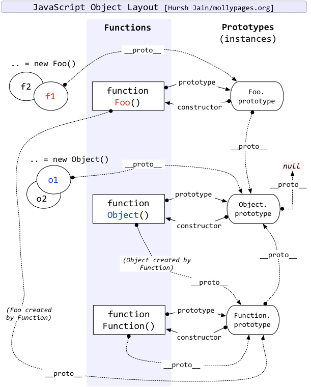

### 对象原型(\_\_proto\_\_)和原型对象(prototype)

JavaScript当中每个对象都有一个特殊的内置属性 [[prototype]]，每个函数都有prototype 属性

`__proto__` 指向构造函数的`prototype`

当我们通过引用对象的属性key来获取一个value时，对象中没有该属性，那么会访问对象[[prototype]]内置属性指向的对象上的属性；




# new 的执行流程

`new` 在 JavaScript 中**不是语法糖**，而是一套**明确、固定的执行流程**。

### 一、`new` 的标准执行步骤

```js
const obj = new Constructor(arg1, arg2)
```

**等价于下面 4 个步骤：**

Step 1：创建一个全新的空对象

```js
const obj = {}
```

Step 2：设置对象原型（建立原型链）

```js
obj.__proto__ = Constructor.prototype
```

> 这一步决定了：
> **实例对象可以访问构造函数 prototype 上的方法**

Step 3：绑定 this，执行构造函数

```js
Constructor.call(obj, arg1, arg2)
```

> 此时：

- `this === obj`
- 构造函数内部对 `this.xxx` 的赋值，都会挂到新对象上

Step 4：返回对象（⚠️有规则）

```js
return obj
```

**但有一个关键分支逻辑：**

| 构造函数返回值  | new 的最终结果 |
| --------------- | -------------- |
| 没有 return     | 返回 obj       |
| return 基本类型 | 忽略，返回 obj |
| return 对象     | ⚠️返回这个对象 |

### 二、完整等价实现（手写 new）

```js
function myNew(Constructor, ...args) {
  // 1. 创建空对象
  const obj = {}

  // 2. 连接原型
  Object.setPrototypeOf(obj, Constructor.prototype)

  // 3. 绑定 this 执行构造函数
  const result = Constructor.apply(obj, args)

  // 4. 返回规则
  return result instanceof Object ? result : obj
}
```

### 一个非常关键的面试陷阱

#### 构造函数 return 对象时会发生什么？

```js
function Person() {
  this.name = 'Tom'
  return { age: 18 }
}

const p = new Person()

console.log(p) // { age: 18 }
console.log(p.name) // undefined
```

👉 **原型链直接断掉**

```js
p.__proto__ !== Person.prototype // true
```
